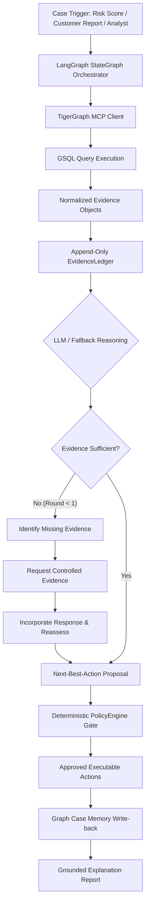

# HHGOA — TigerGraph Agentic Fraud Investigation System

> **A provenance-grounded, policy-gated agentic fraud investigation engine powered by TigerGraph, Model Context Protocol (MCP), LangGraph, and Gemini LLMs.**

Financial fraud investigation requires moving away from brittle, point-in-time risk scoring toward multi-hop graph analysis, provenance-grounded evidence synthesis, uncertainty-aware evidence loops, and deterministic regulatory enforcement. The HHGOA Agentic Fraud Investigation System automates end-to-end card fraud investigations using deep graph context retrieved exclusively through a TigerGraph MCP boundary, evaluating every proposed action against a deterministic Policy Engine.

---

### Verified Engineering Baseline

| Verification Metric | Benchmark / Audit Result | Status |
| :--- | :---: | :---: |
| **Benchmark Dataset Completion** | **20 / 20 Cases (100%)** | **PASS** |
| **Automated Test Suite** | **58 / 58 Tests Passing** | **PASS** |
| **Evidence Citation Validity** | **100.00% (72/72 Citations Valid, 0 Invalid)** | **PASS** |
| **Forbidden Action Leakage** | **0 Violations** | **PASS** |
| **Mandatory Action Omissions** | **0 Omissions** | **PASS** |
| **Direct pyTigerGraph Bypasses** | **0 Bypasses (100% MCP Boundary Intact)** | **PASS** |
| **Additional Evidence Loop Depth** | **Strictly Bounded at Max 1 Round** | **PASS** |
| **Adversarial Security Suite (Surfaces A–K)** | **10 / 10 Security Tests Passing** | **PASS** |

---

## 1. The Problem

Traditional fraud detection relies on static ML risk scores or isolated rule checks. In complex financial networks, an isolated risk score is frequently misleading:
- A high risk score may be a **false alarm** if billing region and device match established customer baselines.
- A low risk score may mask **active fraud** if velocity bursts or shared device clusters connect the card to known fraud rings.

Investigating fraud requires answering complex relational questions:
1. *Does the transaction location match the cardholder's home region?*
2. *Is the device fingerprint shared with other cards that have confirmed historical fraud?*
3. *Is there an abnormal velocity burst of authorizations in a narrow time window?*
4. *What do historical closed cases tell us about this customer's behavior?*
5. *Is current evidence sufficient, or must we request step-up 2FA / customer verification?*
6. *Which actions are legally mandatory (e.g., card block, SAR filing) vs. strictly forbidden for cleared cases?*

---

## 2. What We Built

We built a single-orchestrator LangGraph `StateGraph` agent that conducts structured, multi-step fraud investigations. The agent queries TigerGraph exclusively via standardized **Model Context Protocol (MCP)** tools, constructs an append-only **EvidenceLedger**, evaluates evidence sufficiency, requests additional evidence when needed, and submits all action proposals to a deterministic **PolicyEngine**.



---

## 3. Why TigerGraph

Relational databases struggle to query deep multi-hop entity connections efficiently. TigerGraph provides real-time graph traversal across massive financial networks.

### Graph Schema Topology

```
                  ┌───────────────────┐
                  │   Customer (V)    │
                  └─────────┬─────────┘
                            │ HAS_CARD
                            ▼
                  ┌───────────────────┐
                  │     Card (V)      │
                  └─────────┬─────────┘
                            │ PERFORMED_TXN
                            ▼
                  ┌───────────────────┐
                  │  Transaction (V)  │
                  └────┬─────────┬────┘
     USED_DEVICE       │         │    BILLED_IN
           ┌───────────┘         └───────────┐
           ▼                                 ▼
┌────────────────────┐             ┌───────────────────┐
│ DeviceProfile (V)  │             │ BillingRegion (V) │
└────────────────────┘             └───────────────────┘
```

### 5 Named GSQL Investigative Queries

1. `query_get_transaction_context`: Retrieves transaction amount, timestamp, channel, merchant, and billing region (`addr1`).
2. `query_get_customer_case_history`: Traverses historical closed cases linked to the customer ID to establish behavioral baselines.
3. `query_detect_region_anomaly`: Compares transaction billing region against the customer's primary home region.
4. `query_detect_shared_device`: Traverses 2-hop paths (`Card → Transaction → DeviceProfile ← Transaction ← Card`) to detect device sharing with historical fraud cases.
5. `query_detect_velocity_burst`: Identifies rapid clusters of transactions within short time windows (e.g., 5+ txns in 10 minutes).

---

## 4. Why MCP (Model Context Protocol)

To ensure strict separation of concerns, agent reasoning nodes **never execute direct database calls** (`pyTigerGraph` or `runInstalledQuery`). All graph access is mediated through a typed MCP client layer.

```
LangGraph Agent Node
       │
       ▼
  AgentTools
       │
       ▼
TigerGraphMCPClient (MCP Standard)
       │
       ▼
TigerGraph MCP Server (Tool Registry)
       │
       ▼
 GSQL Query Execution
       │
       ▼
  TigerGraph DB
```

- **Verified MCP Boundary:** **0 direct pyTigerGraph bypasses** exist in agent reasoning or tool code.
- **Transport Transparency:** Supports both `live_mcp` (active TigerGraph endpoint) and `mock_mcp` (offline fallback) with explicit transport metadata tracked in the `EvidenceLedger`.

---

## 5. Why It Is Agentic

The agent is not a single prompt-completion loop. It is a stateful orchestrator that manages uncertainty, gathers additional evidence, and updates recommendations based on incoming findings.

### Key Agentic Capabilities

- **Stateful Workflow:** Built on LangGraph `StateGraph` with explicit state transitions (`initialize_case` → `gather_evidence` → `retrieve_memory` → `build_ledger` → `assess` → `determine_action` → `policy_gate` → `execute` → `update_case` → `write_memory` → `explain`).
- **Uncertainty Assessment:** Evaluates `confidence` (0.0–1.0), `uncertainty` (0.0–1.0), and `evidence_sufficient` (bool).
- **Bounded Additional Evidence Loop:** If evidence is insufficient, the agent routes to `identify_missing_evidence`, requests controlled evidence (e.g., customer verification or step-up 2FA), and reassesses.
- **Strictly Bounded:** `MAX_ADDITIONAL_EVIDENCE_ROUNDS = 1` guarantees the workflow never enters infinite loops.
- **Next-Best-Action Tracking:** Captures `NBA Before` evidence request and `NBA After` evidence response to demonstrate how incoming evidence changes recommendations.

---

## 6. Safety Architecture: LLM Is Advisory, PolicyEngine Is Authoritative

> **Core Invariant:** The LLM proposes hypotheses and recommends actions; the deterministic `PolicyEngine` enforces what is permitted, mandatory, or strictly forbidden.

```
Untrusted Input / Tool Output
              │
              ▼
    EvidenceLedger Formatting
              │
              ▼
     LLM Reasoning Layer
              │
              ▼
Pydantic Structured Output Validation
              │
              ▼
  Hypothesis Whitelist & Citation Validation
              │
              ▼
   Deterministic PolicyEngine Gate
              │
              ▼
   Filtered Executable Actions
```

### Deterministic Policy Rules (`policy_rules.json` / `hackathon-inferred-v1`)

- **POL-001 (Case Creation):** `CREATE_CASE` is mandatory for all triggered investigations.
- **POL-002 (Confirmed Fraud):** `BLOCK_CARD` is mandatory for all `confirmed_fraud` outcomes. `CLOSE_NO_FRAUD` is strictly forbidden.
- **POL-003 (SAR Filing):** `FILE_REPORT` (Suspicious Activity Report) is mandatory if exposure USD ≥ \$1,000.00 or if the fraud pattern is `undocumented`.
- **POL-004 (Cleared Protocol):** If outcome is `cleared`, `VERIFY_WITH_CUSTOMER` and `CLOSE_NO_FRAUD` are mandatory; `BLOCK_CARD` and `FILE_REPORT` are **strictly forbidden**.

---

## 7. Evidence Grounding & EvidenceLedger

Every claim made by the LLM or fallback must be grounded in an immutable evidence item.

$$\text{CLAIM} \longrightarrow \text{EVIDENCE ID} \longrightarrow \text{PROVENANCE (File/Field or GSQL Query)}$$

### Evidence Invariants

- **Immutability:** `Evidence` objects are frozen (`@dataclass(frozen=True)`).
- **Append-Only:** `EvidenceLedger` is an append-only collection. Evidence cannot be modified or deleted once added.
- **Deterministic IDs:** `evidence_id` is generated via SHA-256 hash of `source|source_record_id|evidence_type|provenance` (e.g., `EVD-75D480F6F6FF`). Identical evidence added twice is idempotently deduplicated.
- **Citation Validation:** `validate_and_extract_citations()` verifies every cited `[EVD-XXXXX]` tag in LLM outputs against the ledger. Hallucinated or cross-case evidence IDs are automatically stripped.
- **Verified Benchmark Metric:** **100.00% Citation Validity** (72/72 valid citations, 0 invalid).

---

## 8. Case Memory & Graph Write-Back

Investigation findings do not disappear after case closure. The final node `write_case_memory` persists the entire case resolution back to TigerGraph via MCP:

```
Investigation Resolution
          │
          ▼
   TigerGraph MCP (upsert_vertices)
          │
          ▼
InvestigationCase Vertex
  ├── case_id, customer_id, card_id
  ├── outcome, pattern, exposure_usd
  ├── executed_actions, sar_required
  ├── evidence_json, findings_summary
  └── nba_before_evidence, nba_after_evidence
```

**Contextual Memory Rule:** Historical closed cases retrieved during `retrieve_case_memory` serve as contextual evidence only. A high history of prior cases does **not** override current non-anomalous graph evidence.

---

## 9. Signature Investigation Examples

| Case | Scenario & Focus | Key Safety & Policy Behavior |
| :--- | :--- | :--- |
| **HHG-007** | **Region Contradiction Guardrail** | Transaction scored 0.87 risk score, but billing region 264.0 matches home region 264.0 (`is_anomalous = False`). Guardrail fires: `out_of_region_use` is **suppressed**. Outcome resolves to `confirmed_fraud` (`card_not_present_fraud`), enforcing mandatory `BLOCK_CARD`. |
| **HHG-001** | **Additional Evidence & NBA Loop** | Transaction scored 0.61 (medium risk). Initial assessment identifies uncertainty (`sufficient = False`). NBA Before: `VERIFY_WITH_CUSTOMER`. Customer verification executes, customer disputes transaction. Reassessment updates to `confirmed_fraud`. NBA After: `CREATE_CASE`, `BLOCK_CARD`. Bounded loop completes at Round 1. |
| **HHG-014** | **Cleared Case Policy Enforcement** | Investigation opened via `analyst_request`. Graph evidence shows no fraud indicators. Outcome resolves to `cleared`. PolicyEngine POL-004 fires: `BLOCK_CARD` and `FILE_REPORT` are **forbidden**; `CLOSE_NO_FRAUD` executed. |

---

## 10. Live Demo & Reproduction Guide

### Streamlit Analyst Console

```bash
streamlit run demo_app/app.py
```

The analyst console renders the final state from the existing live MCP investigation runner. It does not make fraud, evidence, or policy decisions in the frontend. See [`docs/DEMO_UI_GUIDE.md`](docs/DEMO_UI_GUIDE.md) for prerequisites and the HHG-007, HHG-001, and HHG-014 priority investigation flows.

### Run Demo Cases (CLI Output)

```bash
# Demo 1: HHG-007 (Region contradiction guardrail)
python -m fraud_investigation.demo --case HHG-007

# Demo 2: HHG-001 (Additional evidence loop & NBA before/after)
python -m fraud_investigation.demo --case HHG-001

# Demo 3: HHG-014 (Cleared case & PolicyEngine protection)
python -m fraud_investigation.demo --case HHG-014
```

### Run Automated Test Suite

```bash
pytest fraud_investigation/tests -v
```

### Run 20-Case Benchmark Evaluation

```bash
python -m fraud_investigation.evaluation.run_eval
```

---

## 11. Terminal Output Structure

When running a demo case, the terminal renderer outputs structured section blocks:

- `[CASE]` — Basic metadata (Case ID, Customer, Card, Flagged Txn, Trigger, Transport).
- `[GRAPH EVIDENCE]` — All evidence items in `EvidenceLedger` with IDs, provenance, supports/contradicts tags.
- `[LLM REASONING] / [FALLBACK REASONING]` — Reasoning source, hypotheses, confidence, uncertainty, citations.
- `[CONTRADICTION GUARDRAIL FIRED]` — Displayed when regional guardrail suppresses invalid hypotheses.
- `[NEXT-BEST-ACTION]` — NBA Before, Evidence Request, NBA After, Loop Rounds (when evidence loop runs).
- `[POLICY DECISION]` — Deterministic rules applied, required/permitted/forbidden actions, SAR requirement.
- `[FINAL OUTCOME]` — Executed actions checklist and outcome resolution.
- `[GROUNDED EXPLANATION]` — Structured report synthesizing findings with `[EVD-XXXXX]` citations.

---

## 12. Benchmark Evaluation Metrics

Evaluated across all 20 cases in the benchmark dataset (`case_pack.csv`):

| Evaluation Metric | Measured Value | Standard / Target |
| :--- | :---: | :---: |
| **Benchmark Dataset Completion** | **20 / 20 Cases (100%)** | 20 Cases |
| **Citation Validity Rate** | **100.00% (72/72 Valid)** | 100.00% |
| **Forbidden Action Leakage** | **0 Leakages** | 0 |
| **Mandatory Action Omissions** | **0 Omissions** | 0 |
| **Direct pyTigerGraph Bypasses** | **0 Bypasses** | 0 |
| **Additional Evidence Rate** | **55.00% (11/20 Cases)** | Bounded Loop Active |
| **Max Additional Evidence Rounds** | **1 Round** | Bounded Max: 1 |
| **HHG-007 Guardrail Status** | **PASS** | `out_of_region_use` Suppressed |

---

## 13. Adversarial Hardening & Defect Discovery

Rather than relying on happy-path tests, the codebase underwent adversarial security auditing. During hardening, **five production defects** were identified, fixed, and verified with regression tests:

1. **Evidence Fabrication in Fallback:** Fallback previously invented an `out_of_region_use` hypothesis for high-risk cases with zero graph evidence. Fixed to set `unverified_transaction` and route to customer verification.
2. **Customer Confirmation Dead Code:** Fallback read key `"contradictions"` while `EvidenceLedger.summary()` produced `"hypotheses_contradicted"`. Fixed key mismatch.
3. **Incomplete Customer Response Detection:** `reassess_investigation` previously missed authorized responses if not explicitly marked with `contradicts="fraud_suspicion"`. Fixed to inspect `observed_value["customer_response"]`.
4. **Customer Response Case Sensitivity Vulnerability:** Exact matching on `"authorized"` failed for `"AUTHORIZED"` or `" authorized "`. Fixed via string normalization (`str(resp).lower().strip()`).
5. **Unvalidated LLM Hypotheses:** LLM reasoning output previously accepted arbitrary string hypotheses. Fixed by adding strict whitelisting against recognized fraud pattern labels (`valid_patterns`).

---

## 14. Security Test Suite (Surfaces A–K)

The test file `fraud_investigation/tests/test_adversarial_security.py` tests 10 distinct attack vectors:

| Surface | Attack Vector Tested | Defense & Safety Verification | Status |
| :--- | :--- | :--- | :---: |
| **Surface A** | Direct prompt injection in `trigger_text` | Injection treated as raw text; PolicyEngine forces mandatory actions. | **PASS** |
| **Surface B** | Indirect prompt injection in graph evidence | Evidence `description` containing system overrides treated as prose. | **PASS** |
| **Surface C** | Tool-output injection containing fake policy directives | Unmodeled tool keys ignored; PolicyEngine computes decision cleanly. | **PASS** |
| **Surface D** | Citation manipulation (fake/cross-case IDs, `<script>`) | `validate_and_extract_citations()` strips all unverified IDs. | **PASS** |
| **Surface E/F** | Proposed forbidden actions (LLM recommends `BLOCK_CARD` on cleared case) | `policy_gate` strips forbidden actions and enforces `CLOSE_NO_FRAUD`. | **PASS** |
| **Surface G** | PolicyEngine bypass via state pre-population | `policy_gate` re-evaluates `PolicyEngine.evaluate()` deterministically. | **PASS** |
| **Surface H** | State poisoning (pre-populated `executed_actions`) | `initialize_case` resets trace and executed actions. | **PASS** |
| **Surface I** | Customer response tampering & injection | Case variants normalized; prompt injection inside disputed response blocked. | **PASS** |
| **Surface J** | Fallback summary key tampering | Fallback filters summary keys strictly against valid pattern enum. | **PASS** |
| **Surface K** | Delimiter confusion (`</explanation_text>`, Markdown blocks) | Generator treats block delimiters as raw text without structural corruption. | **PASS** |

---

## 15. Engineering Trade-offs & Lessons Learned

- **Single Orchestrator vs. Multi-Agent Complexity:** We chose a single LangGraph `StateGraph` orchestrator over multi-agent handoffs. This eliminated state synchronization overhead, prevented inter-agent hallucination loops, and ensured deterministic policy enforcement.
- **GraphRAG vs. Vector Database:** Using TigerGraph GSQL queries for entity relationships (cards, devices, billing regions) proved far superior to vector embeddings for structured financial data, providing 100% exact entity provenance.
- **Auditable Fallback Engine:** Free-tier LLM API rate limits (5 requests/minute) make pure LLM dependencies risky for production batch evaluations. Implementing a deterministic fallback engine ensured 100% workflow completion without sacrificing policy compliance or evidence grounding.

---

## 16. System Limitations

1. **API Rate Limit Fallback:** High-concurrency evaluation runs against Gemini free-tier API trigger 429 rate limits, causing the agent to fall back cleanly to `deterministic_fallback` for remaining cases.
2. **Hackathon-Inferred Policy Rules:** The policy rules (`hackathon-inferred-v1`) were reverse-engineered from the closed case history dataset and hackathon guidelines; they represent a demonstration policy layer rather than a certified banking compliance framework.
3. **Mock Transport Default:** When running without an active TigerGraph instance, `AgentTools` operates via `mock_mcp`, returning simulated graph evidence payloads carrying `transport: "mock_mcp"` provenance.

---

## 17. Repository Map

```
tigergraph-mcp/
├── fraud_investigation/
│   ├── agent/                  # LangGraph StateGraph, nodes, runner, LLM reasoner
│   │   ├── graph.py            # StateGraph compilation & router
│   │   ├── nodes.py            # Workflow node functions
│   │   ├── llm_reasoner.py     # Gemini API integration & fallback reasoning
│   │   ├── tools.py            # AgentTools wrapper for MCP queries
│   │   ├── mcp_client.py       # TigerGraph MCP client boundary
│   │   ├── prompts.py          # LLM system prompts & JSON schemas
│   │   └── state.py            # InvestigationState TypedDict definition
│   ├── evidence/               # Provenance evidence model & ledger
│   │   ├── model.py            # Immutable Evidence dataclass & factory
│   │   └── ledger.py           # Append-only EvidenceLedger store
│   ├── policy/                 # Deterministic PolicyEngine
│   │   └── engine.py           # Deterministic policy evaluator (0 LLM calls)
│   ├── investigation/          # GSQL query extraction logic
│   │   └── queries.py          # Query result to Evidence object mappers
│   ├── evaluation/             # 20-case benchmark evaluation harness
│   │   └── run_eval.py         # Batch evaluator & metrics calculator
│   ├── demo/                   # Terminal demo CLI & report formatter
│   │   ├── __main__.py         # Demo CLI entry point
│   │   └── report_formatter.py # Formatted report string generator
│   ├── config/                 # Policy rules JSON configuration
│   │   └── policy_rules.json   # Rule definitions (hackathon-inferred-v1)
│   └── tests/                  # Test suite (58 tests)
│       ├── test_adversarial_security.py   # Surfaces A-K security tests (10 tests)
│       ├── test_adversarial_edge_cases.py  # E1-E12 edge case tests (12 tests)
│       ├── test_adversarial_edge_cases_e13_e20.py # E13-E20 edge case tests (8 tests)
│       ├── test_agent.py        # Agent workflow tests (7 tests)
│       ├── test_evidence.py     # Evidence model tests (3 tests)
│       ├── test_policy.py       # PolicyEngine tests (4 tests)
│       ├── test_ingestion.py    # Data loading tests (4 tests)
│       └── test_robustness_failures.py # Fallback & error tests (10 tests)
├── docs/                       # Audit & evaluation documentation
│   ├── POST_SECURITY_BENCHMARK_COMPARISON.md
│   ├── FINAL_ADVERSARIAL_AUDIT.md
│   └── PHASE3_EVALUATION_RESULTS.json
├── dataset/                    # Benchmark dataset files
│   ├── case_pack.csv           # 20 exam benchmark cases
│   ├── closed_cases_history.csv # 5,565 closed historical cases
│   └── transactions.csv        # Transactions dataset
├── .env.example                # Environment variables template
├── pytest.ini                  # Pytest configuration
└── README.md                   # Primary project documentation
```

---

## 18. Documentation Index

| Documentation File | Purpose & Contents |
| :--- | :--- |
| [`docs/POST_SECURITY_BENCHMARK_COMPARISON.md`](docs/POST_SECURITY_BENCHMARK_COMPARISON.md) | Per-case outcome comparison between pre- and post-security evaluation runs. |
| [`docs/FINAL_ADVERSARIAL_AUDIT.md`](docs/FINAL_ADVERSARIAL_AUDIT.md) | Deep audit log of discovered defects, security fixes, and verification state. |

---

## 19. Quick Start Guide

### 1. Clone Repository & Setup Environment

```bash
git clone https://github.com/tigergraph/tigergraph-mcp.git
cd tigergraph-mcp

# Create & activate virtual environment
python -m venv venv
# On Windows:
venv\Scripts\activate
# On Linux/macOS:
source venv/bin/activate

# Install dependencies
pip install -r requirements.txt
```

### 2. Configure Environment Variables

Copy `.env.example` to `.env` and set your Gemini API key:

```bash
cp .env.example .env
```

Edit `.env`:
```env
LLM_PROVIDER=google
LLM_MODEL=gemini-3.5-flash
GEMINI_API_KEY=your_gemini_api_key_here
```

### 3. Run Automated Tests

```bash
pytest fraud_investigation/tests -v
```

### 4. Run Hackathon Demo Cases

```bash
python -m fraud_investigation.demo --case HHG-007
python -m fraud_investigation.demo --case HHG-001
python -m fraud_investigation.demo --case HHG-014
```

### 5. Run 20-Case Benchmark Evaluation

```bash
python -m fraud_investigation.evaluation.run_eval
```

---

## Final Project Summary

The **HHGOA TigerGraph Agentic Fraud Investigation System** demonstrates how combining **graph network analysis (TigerGraph MCP)**, **stateful agentic orchestration (LangGraph)**, **provenance evidence tracking (EvidenceLedger)**, and **deterministic regulatory enforcement (PolicyEngine)** produces a transparent, auditable, and security-hardened fraud investigation platform ready for modern banking enterprise requirements.
